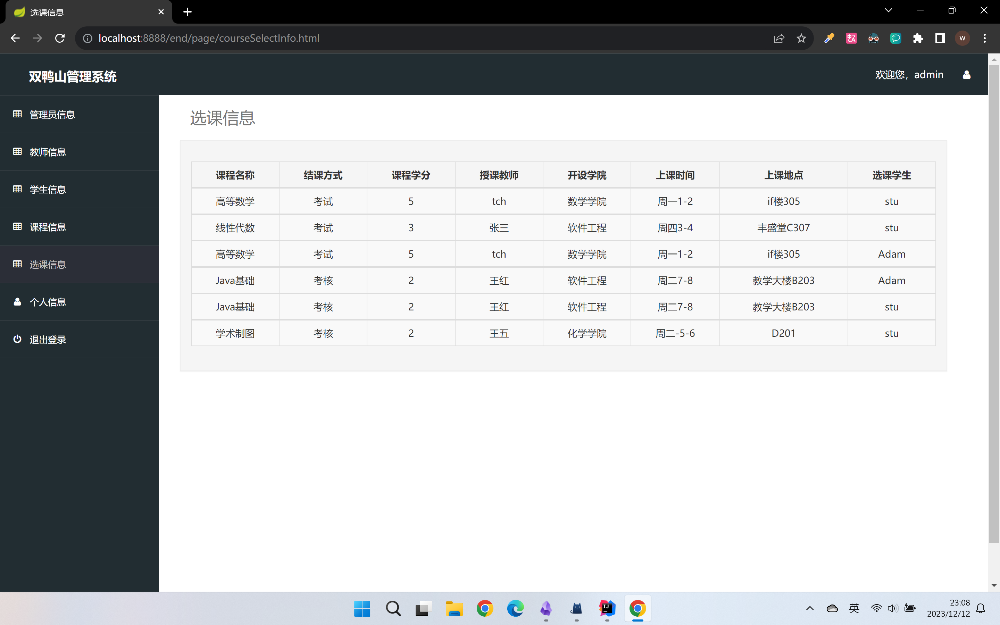

# duckManagementSystem 双鸭山教务管理系统

首先，感谢阅读。

## 简介

这是本人于 2023 年大二编写的 Java 基础课程的期末大作业。

一个基于 Sping Boot + Vue + MyBatis 的前后端不分离的教务选课管理系统

duckManagementSystem / 双鸭山管理系统

## 技术栈

- 编译器：IDEA
- 数据库：MySQL
- 前端：HTML,CSS,JavaScript + Vue
- 后端：Spring Boot + MyBatis + Spring MVC
- JDK 版本：jdk1.8

## 上手前请准备

- 初始化

  1. 已经配置 maven
  2. 已经配置 MySQL 数据库

     2.1. 在本地的 MySQL 中，创建一个数据库名称为 duck_management_system 的数据库，并导入我提供的 .sql 文件,

  3. 在 `application.yml` 文件中将密码改成自己 MySQL 的密码
  4. 运行

- 登陆

  1. 管理员: admin
  2. 教师: tch
  3. 学生: stu
  4. 密码均为: 123

## 界面展示

- 登陆
  
- 管理员
  - 账号主页
    
  - 管理员
    
  - 教师
    
  - 学生
    
  - 课程
    
  - 选课
    
- 教师
  - 账号主页
    
  - 授课
    
- 学生
  - 课程
    
  - 选课
    
